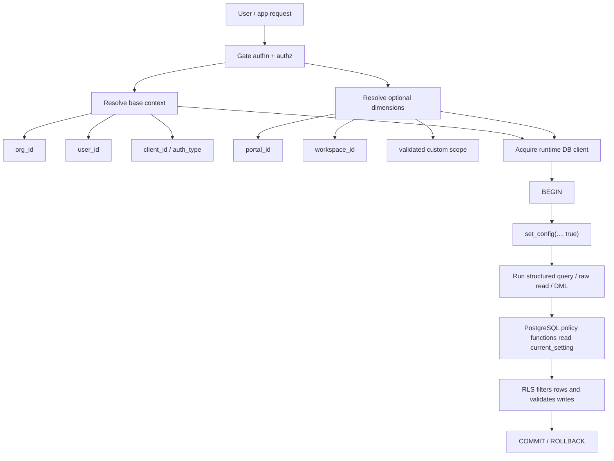
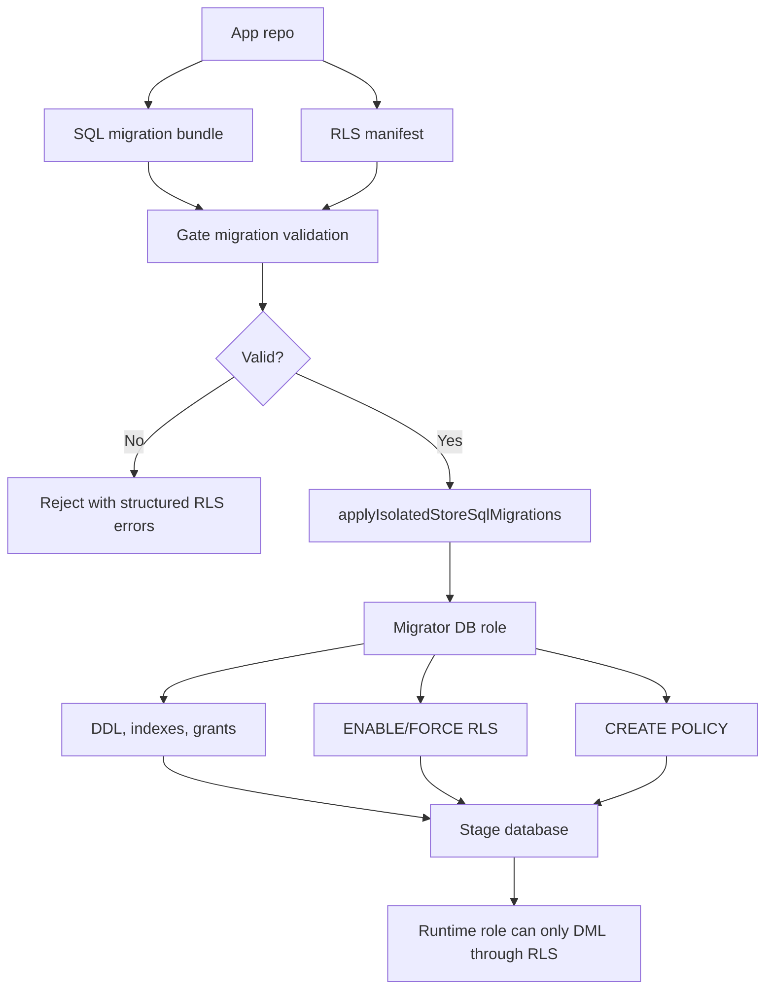
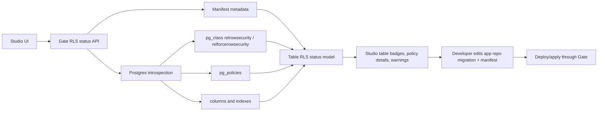
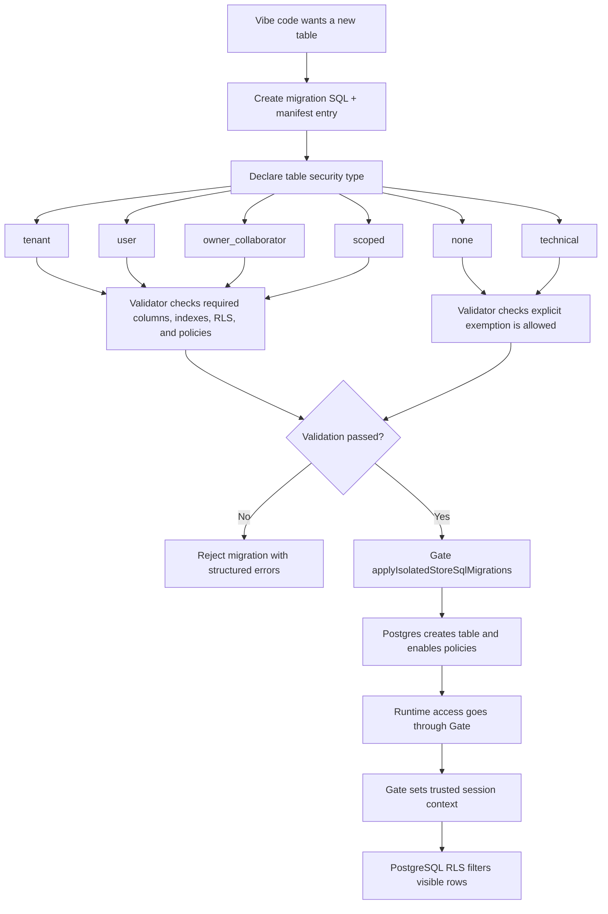

# Isolated SQL stores PostgreSQL RLS plan (Gate)

> **SOURCE**: This file is copied from `docs/isolated-sql-rls-plan.md` in the fusebase-gate repo. Edit that file, then run `npm run mcp:skills:generate`.

---
---
version: "1.0.0"
mcp_prompt: none
source: "docs/isolated-sql-rls-plan.md"
last_synced: "2026-06-15"
title: "Isolated SQL stores PostgreSQL RLS plan (Gate)"
category: specialized
---

# Isolated SQL stores PostgreSQL RLS plan (Gate)

> **SOURCE**: This file is copied from `docs/isolated-sql-rls-plan.md` in the fusebase-gate repo. Edit that file, then run `npm run mcp:skills:generate`.

---

# Isolated SQL stores — PostgreSQL RLS plan for Gate

Short summary for quick reading: for `gate isolated stores`, the recommended `v1` model is `org_id + user_id` RLS enforced by PostgreSQL itself, with optional trusted dimensions such as `portal_id`, `workspace_id`, or app-specific scope IDs layered on top. Gate now injects per-request session context into the DB connection and exposes warn-only RLS validation plus read-only RLS introspection. The production target is still to run migrations under a separate migrator role and runtime queries under an RLS-bound runtime role. The key rule is that table security is not guessed from SQL automatically: every app-owned table must be explicitly classified as `tenant`, `user`, `owner_collaborator`, `scoped`, `none`, or `technical`, and CI or migration validation must check that the SQL matches that declared security model.

Practical security plan for adding PostgreSQL Row-Level Security (RLS) to `gate isolated stores` in a way that matches midsize customer expectations.

This document is intentionally focused on the current Gate architecture:

- separate physical stage databases per store/stage
- app-owned SQL schema managed through migration bundles
- feature-token or user-token runtime access through Gate
- raw DDL blocked on `executeIsolatedStoreSql`
- Studio frontend calling Gate APIs for isolated-store inspection and data operations

It is not a generic PostgreSQL overview.

---

## Current code facts that matter

Confirmed from current Gate code and docs:

- each isolated SQL stage is its own physical PostgreSQL database
- Gate currently uses a single configured runtime PostgreSQL identity for normal SQL stage access (`ISOLATED_PG_RUNTIME_USER` / `runtimeUsername`)
- the auto-provisioner currently creates each stage database with that runtime role as owner
- schema changes are intended to flow through `applyIsolatedStoreSqlMigrations`
- raw `executeIsolatedStoreSql` is now restricted to `INSERT`, `UPDATE`, `DELETE`; DDL is blocked
- Gate already has user/token auth context, org scope, app client scope, and optional `resourceScope` on `isolated_store_stage_instance`

Why this matters for RLS:

- RLS is not just about table policies; it depends on the actual PostgreSQL role that runs the query and on per-request session context
- Gate now propagates transaction-local runtime context on isolated SQL runtime paths (`app.org_id`, `app.user_id`, `app.client_id`, `app.auth_type`, `app.portal_id`, `app.workspace_id`) and accepts scalar request-scoped `rlsContext` values for app-specific settings such as `app.project_id`
- today the runtime DB role is too privileged for a midsize-grade RLS story if left as-is

---

## Prototype status

The current implementation is ready for end-to-end prototype testing.

Implemented:

- Gate runtime SQL paths set transaction-local RLS settings on the same PostgreSQL transaction that executes the request
- standard settings are injected automatically for **user/org-scoped** runtime tokens: `app.org_id`, `app.user_id`, `app.client_id`, `app.auth_type`, and often `app.portal_id` / `app.workspace_id` when Gate can derive them from auth scopes
- **Portal iframe app tokens** (`fbsfeaturetoken` in a portal brick) typically get `app.org_id` only — **not** `app.portal_id`. Use verified `portalFeatureContextToken` on the backend ([portal-embed-context.md](./portal-embed-context.md))
- custom scalar settings are available through request `rlsContext`; for example `{"project_id": "..."}` becomes `app.project_id`
- `rlsContext` keys are constrained to safe identifiers, may be passed as `project_id` or `app.project_id`, and cannot override standard keys
- `rlsManifest` is accepted on migration status/apply/adopt paths and is validated in warn-only mode
- Gate exposes `getIsolatedStoreSqlRlsStatus` for read-only table/policy/column/index introspection
- Studio shows table-level RLS badges, policy counts, and warnings; it does not edit policies directly
- apps-cli can build isolated SQL migration bundles and call status, dry-run, or apply through Gate; forwarding `rlsManifest` is behind the apps-cli `postgres-rls` flag

Not production-grade yet:

- `rlsManifest` validation is warn-only and does not block unsafe migrations
- custom `rlsContext` proves shape, not authorization; apps must authorize the scope before passing it, or policies must verify membership in the database by `org_id` and `user_id`
- the isolated Postgres role split is not complete; runtime access can still be too privileged until migrator/runtime roles are separated
- Studio does not provide direct policy editing and does not let operators inject arbitrary custom `rlsContext` while browsing data
- CI linting for RLS manifests/migrations is not wired as a required release gate

Testing rule for the prototype: start with app-owned migrations and, when testing RLS validation, enable the apps-cli `postgres-rls` flag before sending the manifest to Gate. Apply through apps-cli/Gate, then inspect live RLS state in Studio. Do not treat custom request IDs as trusted RLS context unless the app route or DB policy has already authorized that scope.

---

## 1. Recommendation

For `v1`, use a **combined `org_id + user_id` model** with a clear default:

- every app-owned table must carry `org_id`
- user-private tables must also carry `user_id`
- portal/workspace-scoped tables may carry `portal_id` and/or `workspace_id`
- app-specific scoped tables may carry explicit custom scope columns such as `project_id`, `account_id`, or `region_id`
- shared business objects should carry:
  - `org_id`
  - `owner_user_id`
  - optional collaborator relation table

Recommended baseline:

- **always scope by `org_id` first**
- then optionally scope by `user_id` for private data
- then optionally narrow by trusted scope dimensions such as `portal_id`, `workspace_id`, or app-defined IDs
- use owner/collaborator patterns only where the product really needs sharing

This is the best fit for Gate because:

- `orgId` is already a first-class routing/auth concept in Gate
- user-facing feature tokens already resolve a user context
- midsize customers usually expect both:
  - strict tenant separation
  - user-level isolation inside a tenant

Do **not** use `user_id`-only as the main model. It is too weak for tenant isolation.

Do **not** rely only on app-side filters like `WHERE user_id = ...`. That is not enforceable.

Recommended `v1` operating rule:

- all user-facing data access goes through Gate
- Gate injects trusted session context into PostgreSQL
- RLS policies read only that session context
- app code never decides the effective tenant or user by itself

On one slide / in plain language:

1. vibe code wants a new table
2. it cannot silently create schema in the database
3. it must create a migration plus a manifest entry
4. the manifest must declare what kind of table this is:
   - `tenant`
   - `user`
   - `owner_collaborator`
   - `scoped`
   - `none`
   - `technical`
5. validation checks whether the SQL matches that declared security type
6. only then Gate applies the migration
7. later, runtime access goes through Gate, and PostgreSQL RLS filters rows by trusted session context

---

## 2. Proposed architecture fit for `gate isolated stores`

### 2.1 Session context model

Gate should set PostgreSQL session-local settings per request, for example:

- `app.org_id`
- `app.user_id`
- `app.portal_id`
- `app.workspace_id`
- `app.client_id`
- `app.auth_type`

Recommended implementation pattern:

1. acquire pooled client
2. `BEGIN`
3. `SELECT set_config('app.org_id', $1, true)`
4. `SELECT set_config('app.user_id', $2, true)`
5. optionally set `app.portal_id`, `app.workspace_id`, and validated custom dimensions from `rlsContext`
6. run the actual query or structured operation
7. `COMMIT` / `ROLLBACK`

Use transaction-local settings only:

- `SET LOCAL ...`
- or `set_config(..., true)`

Do **not** use plain session-level `SET` on pooled connections.

### 2.2 Who sets the context

Gate must set the context, not the app.

Reason:

- only Gate has the trusted auth context
- the frontend or vibe-coded app must not be allowed to choose arbitrary `userId` / `orgId`

Gate already has the needed inputs:

- `orgId` from the route and authz checks
- `userId` from user auth or feature token auth context
- `clientId` from token client scope

Optional dimensions must follow the same rule:

- `portalId` must come from a Gate-resolved portal binding or an already-authorized portal route/context
- `workspaceId` must come from a Gate-resolved workspace binding or an already-authorized workspace route/context
- custom IDs must either be verified by Gate against an allowlisted claim/resource scope or checked inside the database through membership tables
- frontend-provided IDs are request inputs, not trusted RLS context, until Gate has authorized them

### 2.2.1 Trusted scope dimensions

The model should be "mandatory tenant context plus optional narrowing dimensions":

| Dimension      |                  Required | Source of truth                             | Typical table column                            | Notes                                                                          |
| -------------- | ------------------------: | ------------------------------------------- | ----------------------------------------------- | ------------------------------------------------------------------------------ |
| `org_id`       |                       yes | Gate org route/authz                        | `org_id text not null`                          | Always the first isolation boundary. Gate ids are platform strings, not UUIDs. |
| `user_id`      | yes for user-facing paths | Gate auth actor                             | `user_id text not null` or `owner_user_id text` | Required for private rows and ownership checks.                                |
| `portal_id`    |                  optional | Gate portal binding/context                 | `portal_id text`                                | Only set when Gate can prove the portal is in the current org and token scope. |
| `workspace_id` |                  optional | Gate workspace binding/context              | `workspace_id text`                             | Useful for multi-workspace apps inside one org.                                |
| custom app ID  |                  optional | Gate-validated scope or DB membership table | `project_id text`, `account_id uuid`, etc.      | Use UUID only for app-owned ids that are actually UUID-shaped.                 |

Recommended session settings:

- `app.org_id`
- `app.user_id`
- `app.portal_id`
- `app.workspace_id`
- `app.client_id`
- `app.auth_type`

For custom dimensions, runtime SQL request bodies may pass `rlsContext`.

Example:

```json
{
  "sql": "select * from tasks",
  "rlsContext": {
    "project_id": "9a5b7d2e-7f3a-4a91-9a7d-7a5f3d1e2a01"
  }
}
```

Gate maps each allowed key to a transaction-local `app.<key>` setting, so the example above becomes `app.project_id`. The key may be written as `project_id` or `app.project_id`; standard trusted keys such as `org_id`, `user_id`, `portal_id`, and `workspace_id` are reserved and cannot be overridden. Values must be scalar (`string`, `number`, `boolean`, or `null`).

Security rule: `rlsContext` values are request-scoped inputs. Use them only for scopes that the app route/business logic has already authorized, or combine them with DB-side membership checks scoped by `org_id` and `user_id`.

### 2.3 Runtime path vs backend path

Recommended split:

- **user-facing runtime path**
  - use end-user or feature-token auth
  - Gate resolves `orgId` and `userId`
  - Gate injects RLS session context

- **backend/service path**
  - allowed only for jobs, migrations, seeds, imports, maintenance
  - not used for user-personalized reads unless it also carries trusted end-user identity

Rule for `v1`:

- if a path needs user-level isolation, it must reach Gate in user context
- service tokens should not be a silent fallback for user-facing app reads
- public/visitor apps are compatible with RLS when they use the platform-issued app token; anonymous visitors simply lack `app.user_id`, so user-scoped policies return no rows while portal/org-scoped policies can still work from trusted platform context

### 2.4 Roles and trust boundaries

For midsize expectations, move to a two-role SQL model per isolated Postgres server:

- `isolated_store_migrator`
  - owns schema objects
  - applies migrations
  - may create/alter/drop tables, policies, indexes
  - must not be used for normal runtime reads/writes

- `isolated_store_runtime`
  - used by runtime queries and structured data writes
  - `SELECT/INSERT/UPDATE/DELETE` only
  - no DDL
  - no `BYPASSRLS`
  - not superuser
  - not table owner

Optional third role:

- `isolated_store_readonly_debug`
  - explicit operator or support-only access
  - preferably still subject to RLS unless there is a separate audited break-glass path

Break-glass/admin view is a separate Gate capability, not a property of normal runtime access. The permission is `isolated_store.rls.bypass`; Gate binds it only to explicit read-only admin/support row endpoints (`countIsolatedStoreSqlRowsRlsBypass`, `selectIsolatedStoreSqlRowsRlsBypass`) that log actor, org, store, stage, and table. These endpoints set trusted transaction-local `app.rls_admin=true`; table `SELECT` policies must include an admin branch when Studio/Admin should see all rows. It must not be granted to app/client runtime tokens and must not be used by `queryIsolatedStoreSql`, normal structured row APIs, writes, or migrations.

What must not happen:

- runtime role owning app tables
- runtime role having `BYPASSRLS`
- migrations executed under the same role as user runtime traffic
- broad `GRANT ALL` or `GRANT ... TO PUBLIC`

### 2.5 Table ownership and FORCE RLS

PostgreSQL owners normally bypass RLS unless `FORCE ROW LEVEL SECURITY` is enabled.

Therefore:

- every app-owned table that participates in tenant/user isolation must have:
  - `ENABLE ROW LEVEL SECURITY`
  - `FORCE ROW LEVEL SECURITY`

Even with `FORCE`, the cleaner and safer model is still:

- table owner = migrator role
- runtime queries = runtime role

### 2.6 Runtime request flow



The important invariant is that the query and all `set_config(..., true)` calls run in the same transaction on the same pooled connection.

### 2.6.1 Migration and policy flow



### 2.6.2 Studio observability flow



Studio should be able to show RLS status per table. For `v1`, Studio should not be the source of truth for changing policies directly; it can later generate a migration/manifest patch, but the durable change should still flow through the app repo and Gate migration path.

### 2.7 Recommended default data model patterns

#### Pattern A — org-shared table

Use for shared reference/business objects inside a tenant.

Columns:

- `id`
- `org_id text not null`
- business columns

Policy:

- all reads/writes require `org_id = nullif(current_setting('app.org_id', true), '')`

#### Pattern B — user-private table

Use for private drafts, personal preferences, private carts, personal notes.

Columns:

- `id`
- `org_id text not null`
- `user_id text not null`
- business columns

Policy:

- org match
- user match

#### Pattern C — owner/shared/collaborator

Use for business objects that can be shared.

Columns:

- `id`
- `org_id text not null`
- `owner_user_id text not null`

Separate collaborator table:

- `entity_id`
- `org_id`
- `user_id`
- `role`

Policy:

- same org
- user is owner **or** listed in collaborator table

This is enough for `v1`. Avoid more complex ACL/RBAC-in-table designs at first.

#### Pattern D — scoped table

Use when rows are tenant-owned but also belong to a portal, workspace, project, account, region, or another product-specific boundary.

Columns:

- `id`
- `org_id text not null`
- optional platform scope column, for example `portal_id text` or `workspace_id text`
- optional custom scope column, for example `project_id text not null`
- business columns

Policy:

- org match
- required scope match, when the request is operating inside that scope
- for custom scopes, either compare to a Gate-validated setting or use an `exists (...)` membership check against a scoped membership table

Data representation is explicit. RLS does not add hidden columns. If a table is scoped by workspace, rows need a `workspace_id` column or a join path to a table that contains one. The same applies to portal and app-specific IDs.

---

## 3. Migration/security enforcement

### 3.1 What should be mandatory in SQL migrations

The validator should not try to infer business meaning from raw SQL alone. It needs an explicit declaration for each created table or migration target, for example:

- `tenant`
- `user`
- `owner_collaborator`
- `scoped`
- `none`
- `technical`

This is also the practical difference between our recommended Gate path and a plain “write policies manually” workflow: Supabase-style SQL still relies on developer intent, but for Gate we want that intent declared and machine-validated.

For app-owned tables in `v1`, require:

- `org_id text not null`
- `user_id text not null` for user-private tables
- `portal_id text` / `workspace_id text` / custom scope columns when the manifest declares them
- index on `org_id`
- composite index on `(org_id, user_id)` when user-scoped
- composite index on `(org_id, portal_id)`, `(org_id, workspace_id)`, or `(org_id, custom_scope_id)` when scope-scoped
- `ALTER TABLE ... ENABLE ROW LEVEL SECURITY`
- `ALTER TABLE ... FORCE ROW LEVEL SECURITY`
- at least one `CREATE POLICY`

Recommended policy convention:

- one select policy
- one write policy
- or a single `FOR ALL` policy only when semantics are truly identical

### 3.2 What Gate should enforce in the product

#### Immediate enforcement

These are practical and realistic for the current architecture:

1. continue blocking DDL on `executeIsolatedStoreSql`
2. run migrations only through `applyIsolatedStoreSqlMigrations`
3. add runtime DB session context injection in Gate
4. split DB roles:
   - migrator
   - runtime
5. expose read-only RLS status/introspection through Gate for Studio

### 3.2.1 Simple example for a call

Example: an e-commerce app creates these tables:

- `orders`
- `order_items`
- `draft_carts`
- `theme_catalog`
- `import_orders_tmp`
- `workspace_members`

Where RLS is needed:

- `orders`
  - tenant business data
  - users from one org must not see orders of another org
- `order_items`
  - same tenant scope as orders
- `draft_carts`
  - user-private data inside an org
  - needs both `org_id` and `user_id`
- `workspace_members`
  - scoped data inside an org
  - needs `org_id` and `workspace_id`, plus user/member columns

Where RLS is not necessarily needed:

- `theme_catalog`
  - if this is a global visual-theme catalog shared by all apps and all orgs
  - classify as `none`
- `import_orders_tmp`
  - temporary technical import table not exposed to user runtime
  - classify as `technical`

The important part is that this is declared explicitly and then validated. The validator should not guess business meaning from SQL names alone.

#### Next enforcement step

Add a migration linter in CI for `postgres/migrations/*.sql`.

Minimal checks:

- detect `CREATE TABLE` without `org_id`
- detect user-private table definitions without `user_id`
- detect missing index for `org_id`
- detect missing composite index for declared scope dimensions
- detect missing `ENABLE ROW LEVEL SECURITY`
- detect missing `FORCE ROW LEVEL SECURITY`
- detect missing `CREATE POLICY`
- forbid:
  - `ALTER TABLE ... DISABLE ROW LEVEL SECURITY`
  - `GRANT ... TO PUBLIC`
  - `BYPASSRLS`
  - superuser role assumptions in migration scripts

### 3.3 Recommended product rule

For `v1`, use an explicit table annotation or manifest rule in the app repo:

- `tenant`
- `user`
- `owner_collaborator`
- `scoped`
- `none`
- `technical`

This matters because not every table needs the same policy.

Examples:

- `event_categories` may be a tenant-shared table
- `draft_carts` may be private by user
- `project_comments` may be owner/collaborator
- `workspace_members` may be scoped by `workspace_id`
- `visual_themes_catalog` may be `none` if global and truly context-free
- `import_products_tmp` may be `technical`

Without this annotation, a linter will produce too many false positives.

Table-creation flow for vibe-coded apps:



Example manifest shape:

```json
{
  "rls": {
    "tables": {
      "orders": {
        "classification": "tenant",
        "orgColumn": "org_id"
      },
      "draft_carts": {
        "classification": "user",
        "orgColumn": "org_id",
        "userColumn": "user_id"
      },
      "workspace_members": {
        "classification": "scoped",
        "orgColumn": "org_id",
        "scopes": [
          {
            "name": "workspace",
            "column": "workspace_id",
            "setting": "app.workspace_id"
          }
        ]
      },
      "project_comments": {
        "classification": "owner_collaborator",
        "orgColumn": "org_id",
        "ownerColumn": "owner_user_id",
        "collaboratorTable": "project_comment_collaborators"
      },
      "visual_themes_catalog": {
        "classification": "none",
        "reason": "global immutable catalog"
      }
    }
  }
}
```

The exact file name can be decided with the app manifest work, but the important constraint is that RLS intent is versioned with the app and reviewed with the migration.

### 3.4 Which tables can be exempt

Allow a narrow explicit exception list:

- migration journal table `fusebase_schema_migrations`
- technical staging/import tables used only inside migrations
- pure internal metadata tables, if any

But app-owned business tables should not silently skip RLS.

### 3.5 Studio visibility and edit ownership

Studio should consume a Gate RLS status API and show, per table:

- declared manifest classification
- whether PostgreSQL reports RLS enabled
- whether PostgreSQL reports FORCE RLS enabled
- policy names and commands from `pg_policies`
- required scope columns and whether they exist
- required indexes and whether they exist
- warnings when DB state and manifest state disagree

For `v1`, direct policy editing in Studio should be out of scope. Direct UI edits create a split-brain problem: the app repo says one thing, the live database says another, and the next deploy may overwrite or drift from the UI change. A later Studio workflow can generate a migration and manifest patch for review, but the actual apply path should remain the same Gate migration path.

---

## 4. Example SQL pattern

### 4.1 Session helpers

Use `current_setting(..., true)` so missing settings return `NULL` instead of throwing.

```sql
create or replace function app_current_org_id() returns text
language sql
stable
as $$
  select nullif(current_setting('app.org_id', true), '')
$$;

create or replace function app_current_user_id() returns text
language sql
stable
as $$
  select nullif(current_setting('app.user_id', true), '')
$$;

create or replace function app_current_portal_id() returns text
language sql
stable
as $$
  select nullif(current_setting('app.portal_id', true), '')
$$;

create or replace function app_current_workspace_id() returns text
language sql
stable
as $$
  select nullif(current_setting('app.workspace_id', true), '')
$$;
```

### 4.2 Example user-private table

```sql
create table carts (
  id uuid primary key,
  org_id text not null,
  user_id text not null,
  status text not null,
  created_at timestamptz not null default now()
);

create index idx_carts_org_id on carts (org_id);
create index idx_carts_org_user on carts (org_id, user_id);

alter table carts enable row level security;
alter table carts force row level security;

create policy carts_select_policy on carts
for select
using (
  org_id = app_current_org_id()
  and user_id = app_current_user_id()
);

create policy carts_write_policy on carts
for insert, update, delete
using (
  org_id = app_current_org_id()
  and user_id = app_current_user_id()
)
with check (
  org_id = app_current_org_id()
  and user_id = app_current_user_id()
);
```

### 4.3 Example org-shared table

```sql
create table products (
  id uuid primary key,
  org_id text not null,
  sku text not null,
  title text not null
);

create index idx_products_org_id on products (org_id);

alter table products enable row level security;
alter table products force row level security;

create policy products_org_policy on products
using (org_id = app_current_org_id())
with check (org_id = app_current_org_id());
```

### 4.4 How Gate should set the context

Pseudo-flow per runtime request:

```sql
begin;
select set_config('app.org_id', $1, true);
select set_config('app.user_id', $2, true);
select set_config('app.client_id', $3, true);
select set_config('app.portal_id', $4, true);
select set_config('app.workspace_id', $5, true);
-- actual application query here
commit;
```

This must happen inside the same transaction and connection as the actual query.

### 4.5 Example scoped table

```sql
create table workspace_tasks (
  id uuid primary key,
  org_id text not null,
  workspace_id text not null,
  owner_user_id text not null,
  title text not null,
  created_at timestamptz not null default now()
);

create index idx_workspace_tasks_org_workspace on workspace_tasks (org_id, workspace_id);

alter table workspace_tasks enable row level security;
alter table workspace_tasks force row level security;

create policy workspace_tasks_policy on workspace_tasks
using (
  org_id = app_current_org_id()
  and workspace_id = app_current_workspace_id()
)
with check (
  org_id = app_current_org_id()
  and workspace_id = app_current_workspace_id()
);
```

If `app.workspace_id` is not set, this policy returns no rows because the comparison with `NULL` does not pass. That is the desired fail-closed behavior for scoped access.

---

## 5. Risks / open questions

### 5.1 Biggest current gap

Gate now propagates trusted runtime context into PostgreSQL sessions for isolated SQL runtime calls. The remaining gap is that RLS cannot be considered a complete product baseline until table policies, manifest validation, and runtime/migrator role split are in place.

Current isolation is still mainly:

- store/stage database separation
- token permission checks
- optional resource scope
- runtime context for policy functions

That is useful, but it is not enough by itself: policies must exist on tables, and the runtime role must not be able to bypass them.

### 5.2 Role model changes are required

Current provisioning uses the runtime DB role as the database owner. For midsize-grade RLS, that should change.

Recommended change:

- database owner / table owner path should move to migrator role
- runtime role should be non-owner and RLS-bound

Gate supports the split through optional isolated Postgres env vars:

- `ISOLATED_PG_MIGRATOR_USER`
- `ISOLATED_PG_MIGRATOR_PASSWORD`

When these are configured for server-backed isolated Postgres stores, Gate resolves schema operations (`applyIsolatedStoreSqlMigrations`, baseline adoption, checksum repair) with the migrator credentials while runtime data/query paths keep using `ISOLATED_PG_RUNTIME_USER` / `ISOLATED_PG_RUNTIME_PASSWORD`. Auto-provisioned databases are created with the migrator as owner, Gate attempts to set the runtime role to `NOBYPASSRLS`, and migration apply grants runtime DML/function/sequence privileges on the target schema.

For already-provisioned legacy databases, the role split is an explicit operator action because it changes PostgreSQL roles and privileges outside the migration journal. Gate ships a bootstrap command for this path:

```bash
npm run isolated-pg:bootstrap-rls-runtime -- --database <stage_database> --schema public
```

Required env before running it:

- `ISOLATED_PG_ADMIN_*` points at the server admin/provisioner identity
- `ISOLATED_PG_MIGRATOR_USER` / `ISOLATED_PG_MIGRATOR_PASSWORD` points at the schema owner / migration identity
- `ISOLATED_PG_RUNTIME_USER` / `ISOLATED_PG_RUNTIME_PASSWORD` points at a distinct login role for app runtime queries

The command creates or repairs the runtime role with `NOBYPASSRLS`, grants current and default runtime privileges for the target schema, and verifies runtime posture by connecting as the runtime role. It fails if the runtime role equals the admin role unless `--allow-runtime-admin` is passed for a local-only experiment. Use `--transfer-ownership` when an existing DB also needs database/schema/object ownership moved to the migrator role; without that flag the command only repairs runtime role posture and grants.

### 5.3 `resourceScope` is not a substitute for RLS

`resourceScope` on `isolated_store_stage_instance` protects stage access, not row access.

It answers:

- can this token reach this stage DB?

It does not answer:

- which rows inside that stage DB may the current user read?

Both layers are useful, but they solve different problems.

Optional `portal_id`, `workspace_id`, and custom IDs should follow the same split: token/stage scope can authorize access to a store or stage, while RLS decides which rows are visible inside the database.

### 5.3.1 Custom scope trust

Custom app dimensions are useful, but they are easy to weaken if Gate treats request parameters as trusted context. The safe options are:

- Gate validates the requested custom ID against token claims, route bindings, or a platform-owned membership source before treating `app.<custom_id>` as authoritative
- the database policy checks membership through app tables, scoped by `org_id` and `user_id`

Current prototype support: Gate accepts scalar `rlsContext` settings and prevents overriding standard keys. This is enough to test app-owned scopes such as `project_id`, but it is not a complete platform authorization model by itself. Do not set arbitrary custom RLS settings directly from frontend request payloads unless the app has already authorized that scope.

Verification rule: `rlsContext` proving visible in `current_setting('app.project_id', true)` is necessary but not sufficient. PostgreSQL still skips policies when the runtime role has `BYPASSRLS` or otherwise owns/bypasses the table. RLS smoke tests must also check Gate RLS status and require `bypassRls=false` before treating scoped reads as policy-enforced.

For optional app scopes, use policy expressions that make the optional behavior explicit:

```sql
AND (
  NULLIF(current_setting('app.project_id', true), '') IS NULL
  OR project_id = NULLIF(current_setting('app.project_id', true), '')
)
```

### 5.4 Raw SQL remains dangerous even with RLS

RLS protects row visibility, but:

- badly designed policies can still leak too much
- unsafe functions or owner-level roles can bypass assumptions
- admin/debug roles can still create operational risk

So the plan should assume:

- structured operations first
- raw SQL only for operators
- migration linting in CI

### 5.5 False sense of security

The biggest false-security failure modes are:

- adding `user_id` columns but not enabling `FORCE ROW LEVEL SECURITY`
- using RLS with the table owner as runtime role and assuming it is enforced
- forgetting to set session context on every pooled connection
- letting service-token backend calls stand in for real user context
- having tables without policies but assuming org filters in app code are enough
- allowing Studio or ad-hoc SQL to edit policies outside the app migration source of truth
- treating custom request IDs as trusted RLS context before Gate validates them

### 5.6 What is too heavy for `v1`

Do not try to solve all of this in the first cut:

- full policy DSL in Gate
- policy generation from ORM models
- automatic semantic classification of every table
- generic ACL engine for every app
- direct Studio policy editing
- browser-issued database tokens that bypass Gate

For `v1`, the right scope is:

1. session context in Gate
2. runtime/migrator role split
3. RLS status/introspection API for Studio and support
4. migration linter
5. strict SQL examples and policy templates
6. apply-only schema discipline

---

## Recommended phased rollout

### Phase 0 — Contract and docs

- done: define RLS manifest shape and table classifications
- done: document mandatory dimensions: `org_id`, `user_id`
- done: document optional dimensions: `portal_id`, `workspace_id`, custom app IDs
- done: document policy templates for `tenant`, `user`, `owner_collaborator`, and `scoped`
- done: define non-goals for `v1`: no direct Studio policy mutation, no full policy DSL, no automatic semantic classifier

### Phase 1 — Guardrails

- done: keep DDL blocked on `executeIsolatedStoreSql`
- done: keep schema changes on `applyIsolatedStoreSqlMigrations`
- done: add manifest-aware migration validation in non-blocking/warn mode first
- next: add migration linter checks in CI
- next: promote selected checks to blocking mode for new apps after prototype validation

### Phase 2 — Runtime plumbing

- done: add per-request transaction-local PostgreSQL session context in Gate
- done: ensure runtime SQL paths use that wrapper
- done: set base context: `app.org_id`, `app.user_id`, `app.client_id`, `app.auth_type`
- done: set optional context from trusted auth scopes only: `app.portal_id`, `app.workspace_id`
- done: support scalar custom `rlsContext` settings for app-specific RLS dimensions such as `app.project_id`
- done: cover runtime context injection in unit tests
- next: add an integration test that proves pooled connections do not leak transaction-local settings between requests

### Phase 3 — RLS status/introspection

- done: add Gate contract for `getIsolatedStoreSqlRlsStatus`
- done: introspect `pg_class`, `pg_policies`, columns, and indexes
- done: expose runtime role metadata: `currentUser`, `bypassRls`, and `superuser`
- done: merge live DB state with manifest declarations
- done: return structured table-level warnings for Studio and support
- done: expose RLS runtime bypass warnings through apps-cli and Studio
- next: add broader integration coverage against a real isolated Postgres stage

### Phase 4 — Role split

- next: add migrator role and runtime role to isolated Postgres config
- next: create databases owned by migrator role, not runtime role
- next: grant runtime role only the minimum DML privileges
- next: make sure runtime role has no `BYPASSRLS` and is not table owner
- next: add migration-time grants so app tables are usable by runtime without making runtime the owner

### Phase 5 — Studio read-only UI

- done: show RLS badge per table in isolated-store table list
- done: show live policy count and table-level warnings
- done: show migration validation status and warnings from `rlsManifest`
- next: add a table detail panel for manifest classification and full policy definitions
- keep: remediation should point to migration/manifest changes, not direct policy edits

### Phase 6 — App onboarding and templates

- done: add apps-cli command to build/apply migration bundles; optional `rlsManifest` forwarding is gated by the apps-cli `postgres-rls` flag
- done: add apps-cli `bundle --rls-status` for runtime role and live table/policy checks
- done: add an app-template example with RLS migrations and manifest
- next: provide polished migration templates for:
  - org-shared
  - user-private
  - owner/collaborator
  - scoped by portal/workspace/custom ID
- next: update demo apps and new app scaffolds

### Phase 7 — Stronger validation

- next: fail migration CI on missing RLS baseline
- next: add optional Gate-side validation endpoint for migration security baseline
- next: promote manifest-aware validation from warning mode to blocking mode for new apps
- next: decide compatibility rules for legacy apps and stores that predate the RLS manifest

---

## Implementation map in Gate

Expected Gate touch points:

- `src/services/isolated-store-postgres-service.ts`
  - add transaction wrapper that sets RLS session context before runtime SQL
  - add Postgres introspection helpers for RLS status
  - add warn-only RLS manifest validation against live table/column/index/policy state
- `src/controllers/isolated-stores/isolated-stores.ts`
  - resolve trusted RLS context from auth, route, app/store binding, and optional scope inputs
  - expose the RLS status endpoint
- `src/api/contracts/ops/isolated-stores/isolated-stores.ts`
  - add API contract for RLS status and validation results
- `src/api/contracts/schemas/isolated-store/isolated-store.ts`
  - add table classification, scope dimension, and RLS status schemas
  - add RLS manifest and validation result schemas
- `src/services/isolated-store-postgres-provisioning-service.ts`
  - move toward migrator/runtime role split during provisioning
- generated SDK/OpenAPI artifacts
  - expose RLS status for Studio and apps-cli
- docs and templates
  - update isolated SQL docs, app scaffolds, and migration examples

---

## Recommended `v1` answer in one paragraph

## For `gate isolated stores`, use a combined `org_id + user_id` RLS model, with `org_id` required on all app-owned business tables and `user_id` added where data is private to a user. Optional dimensions such as `portal_id`, `workspace_id`, and app-specific IDs fit the same model as explicit scoped columns and trusted session settings, but Gate must validate them before they become RLS context. Gate should inject trusted per-request session context into PostgreSQL using transaction-local settings on the same pooled connection that executes the query. Schema must continue to flow only through journaled migrations, and the isolated Postgres server should move from a single runtime owner role to a split `migrator` / `runtime` model so runtime queries are subject to RLS and cannot bypass it. Studio should show RLS status per table through Gate introspection, while policy changes remain migration/manifest-driven. Migration CI should enforce `ENABLE RLS`, `FORCE RLS`, policies, required columns, and indexes as the minimum midsize security baseline.

## Version

- **Version**: 1.0.0
- **Category**: specialized
- **Last synced**: 2026-06-15
---

## Version

- **Version**: 1.0.0
- **Category**: specialized
- **Last synced**: 2026-06-19
