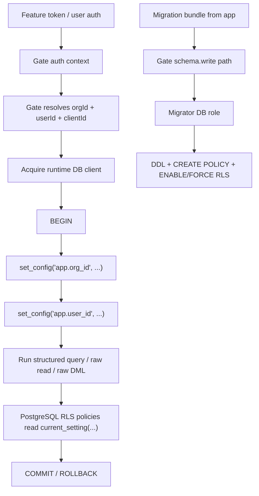
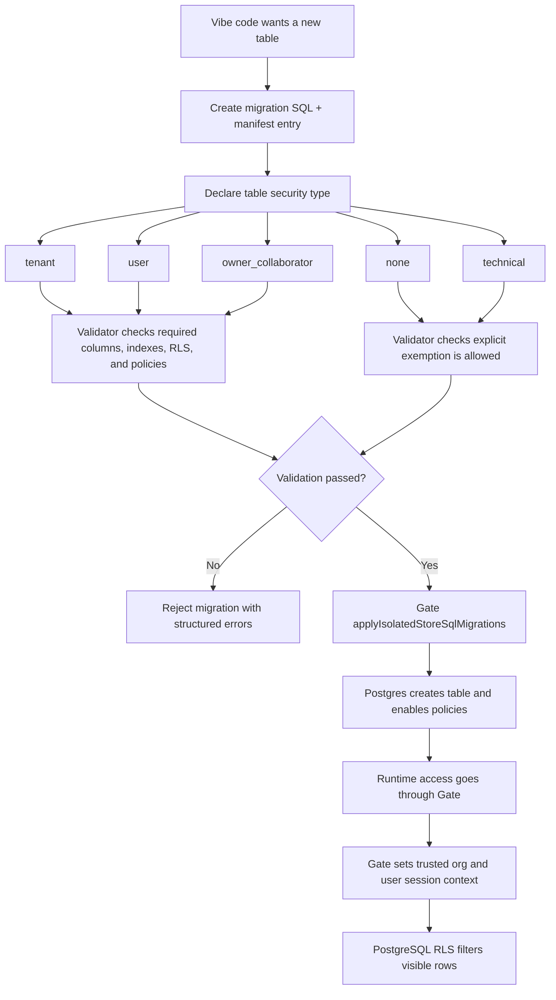

# Isolated SQL stores PostgreSQL RLS plan (Gate)

> **SOURCE**: This file is copied from `docs/isolated-sql-rls-plan.md` in the fusebase-gate repo. Edit that file, then run `npm run mcp:skills:generate`.

---
# Isolated SQL stores — PostgreSQL RLS plan for Gate

Short summary for quick reading: for `gate isolated stores`, the recommended `v1` model is `org_id + user_id` RLS enforced by PostgreSQL itself, with Gate injecting trusted per-request session context into the DB connection, migrations running under a separate migrator role, and runtime queries running under an RLS-bound runtime role. The key rule is that table security is not guessed from SQL automatically: every app-owned table must be explicitly classified as `tenant`, `user`, `owner_collaborator`, `none`, or `technical`, and CI or migration validation must check that the SQL matches that declared security model.

Practical security plan for adding PostgreSQL Row-Level Security (RLS) to `gate isolated stores` in a way that matches midsize customer expectations.

This document is intentionally focused on the current Gate architecture:

- separate physical stage databases per store/stage
- app-owned SQL schema managed through migration bundles
- feature-token or user-token runtime access through Gate
- raw DDL blocked on `executeIsolatedStoreSql`

It is not a generic PostgreSQL overview.

---

## Current code facts that matter

Confirmed from current Gate code and docs:

- each isolated SQL stage is its own physical PostgreSQL database
- Gate currently uses a single configured runtime PostgreSQL identity for normal SQL stage access (`ISOLATED_PG_RUNTIME_USER` / `runtimeUsername`)
- the auto-provisioner currently creates each stage database with that runtime role as owner
- schema changes are intended to flow through `applyIsolatedStoreSqlMigrations`
- raw `executeIsolatedStoreSql` is now restricted to `INSERT`, `UPDATE`, `DELETE`; DDL is blocked
- Gate already has user/token auth context, org scope, app client scope, and optional `resourceScope` on `isolated_store_stage_instance`

Why this matters for RLS:

- RLS is not just about table policies; it depends on the actual PostgreSQL role that runs the query and on per-request session context
- today Gate does not yet propagate user/org context into the PostgreSQL session
- today the runtime DB role is too privileged for a midsize-grade RLS story if left as-is

---

## 1. Recommendation

For `v1`, use a **combined `org_id + user_id` model** with a clear default:

- every app-owned table must carry `org_id`
- user-private tables must also carry `user_id`
- shared business objects should carry:
  - `org_id`
  - `owner_user_id`
  - optional collaborator relation table

Recommended baseline:

- **always scope by `org_id` first**
- then optionally scope by `user_id` for private data
- use owner/collaborator patterns only where the product really needs sharing

This is the best fit for Gate because:

- `orgId` is already a first-class routing/auth concept in Gate
- user-facing feature tokens already resolve a user context
- midsize customers usually expect both:
  - strict tenant separation
  - user-level isolation inside a tenant

Do **not** use `user_id`-only as the main model. It is too weak for tenant isolation.

Do **not** rely only on app-side filters like `WHERE user_id = ...`. That is not enforceable.

Recommended `v1` operating rule:

- all user-facing data access goes through Gate
- Gate injects trusted session context into PostgreSQL
- RLS policies read only that session context
- app code never decides the effective tenant or user by itself

On one slide / in plain language:

1. vibe code wants a new table
2. it cannot silently create schema in the database
3. it must create a migration plus a manifest entry
4. the manifest must declare what kind of table this is:
   - `tenant`
   - `user`
   - `owner_collaborator`
   - `none`
   - `technical`
5. validation checks whether the SQL matches that declared security type
6. only then Gate applies the migration
7. later, runtime access goes through Gate, and PostgreSQL RLS filters rows by trusted `org_id` / `user_id` session context

---

## 2. Proposed architecture fit for `gate isolated stores`

### 2.1 Session context model

Gate should set PostgreSQL session-local settings per request, for example:

- `app.org_id`
- `app.user_id`
- `app.client_id`
- `app.auth_type`

Recommended implementation pattern:

1. acquire pooled client
2. `BEGIN`
3. `SELECT set_config('app.org_id', $1, true)`
4. `SELECT set_config('app.user_id', $2, true)`
5. run the actual query or structured operation
6. `COMMIT` / `ROLLBACK`

Use transaction-local settings only:

- `SET LOCAL ...`
- or `set_config(..., true)`

Do **not** use plain session-level `SET` on pooled connections.

### 2.2 Who sets the context

Gate must set the context, not the app.

Reason:

- only Gate has the trusted auth context
- the frontend or vibe-coded app must not be allowed to choose arbitrary `userId` / `orgId`

Gate already has the needed inputs:

- `orgId` from the route and authz checks
- `userId` from user auth or feature token auth context
- `clientId` from token client scope

### 2.3 Runtime path vs backend path

Recommended split:

- **user-facing runtime path**
  - use end-user or feature-token auth
  - Gate resolves `orgId` and `userId`
  - Gate injects RLS session context

- **backend/service path**
  - allowed only for jobs, migrations, seeds, imports, maintenance
  - not used for user-personalized reads unless it also carries trusted end-user identity

Rule for `v1`:

- if a path needs user-level isolation, it must reach Gate in user context
- service tokens should not be a silent fallback for user-facing app reads

### 2.4 Roles and trust boundaries

For midsize expectations, move to a two-role SQL model per isolated Postgres server:

- `isolated_store_migrator`
  - owns schema objects
  - applies migrations
  - may create/alter/drop tables, policies, indexes
  - must not be used for normal runtime reads/writes

- `isolated_store_runtime`
  - used by runtime queries and structured data writes
  - `SELECT/INSERT/UPDATE/DELETE` only
  - no DDL
  - no `BYPASSRLS`
  - not superuser
  - not table owner

Optional third role:

- `isolated_store_readonly_debug`
  - explicit operator or support-only access
  - preferably still subject to RLS unless there is a separate audited break-glass path

What must not happen:

- runtime role owning app tables
- runtime role having `BYPASSRLS`
- migrations executed under the same role as user runtime traffic
- broad `GRANT ALL` or `GRANT ... TO PUBLIC`

### 2.5 Table ownership and FORCE RLS

PostgreSQL owners normally bypass RLS unless `FORCE ROW LEVEL SECURITY` is enabled.

Therefore:

- every app-owned table that participates in tenant/user isolation must have:
  - `ENABLE ROW LEVEL SECURITY`
  - `FORCE ROW LEVEL SECURITY`

Even with `FORCE`, the cleaner and safer model is still:

- table owner = migrator role
- runtime queries = runtime role

### 2.6 Recommended rollout shape



### 2.7 Recommended default data model patterns

#### Pattern A — org-shared table

Use for shared reference/business objects inside a tenant.

Columns:

- `id`
- `org_id uuid not null`
- business columns

Policy:

- all reads/writes require `org_id = current_setting('app.org_id', true)::uuid`

#### Pattern B — user-private table

Use for private drafts, personal preferences, private carts, personal notes.

Columns:

- `id`
- `org_id uuid not null`
- `user_id uuid not null`
- business columns

Policy:

- org match
- user match

#### Pattern C — owner/shared/collaborator

Use for business objects that can be shared.

Columns:

- `id`
- `org_id uuid not null`
- `owner_user_id uuid not null`

Separate collaborator table:

- `entity_id`
- `org_id`
- `user_id`
- `role`

Policy:

- same org
- user is owner **or** listed in collaborator table

This is enough for `v1`. Avoid more complex ACL/RBAC-in-table designs at first.

---

## 3. Migration/security enforcement

### 3.1 What should be mandatory in SQL migrations

The validator should not try to infer business meaning from raw SQL alone. It needs an explicit declaration for each created table or migration target, for example:

- `tenant`
- `user`
- `owner_collaborator`
- `none`
- `technical`

This is also the practical difference between our recommended Gate path and a plain “write policies manually” workflow: Supabase-style SQL still relies on developer intent, but for Gate we want that intent declared and machine-validated.

For app-owned tables in `v1`, require:

- `org_id uuid not null`
- `user_id uuid not null` for user-private tables
- index on `org_id`
- composite index on `(org_id, user_id)` when user-scoped
- `ALTER TABLE ... ENABLE ROW LEVEL SECURITY`
- `ALTER TABLE ... FORCE ROW LEVEL SECURITY`
- at least one `CREATE POLICY`

Recommended policy convention:

- one select policy
- one write policy
- or a single `FOR ALL` policy only when semantics are truly identical

### 3.2 What Gate should enforce in the product

#### Immediate enforcement

These are practical and realistic for the current architecture:

1. continue blocking DDL on `executeIsolatedStoreSql`
2. run migrations only through `applyIsolatedStoreSqlMigrations`
3. add runtime DB session context injection in Gate
4. split DB roles:
   - migrator
   - runtime

### 3.2.1 Simple example for a call

Example: an e-commerce app creates these tables:

- `orders`
- `order_items`
- `draft_carts`
- `theme_catalog`
- `import_orders_tmp`

Where RLS is needed:

- `orders`
  - tenant business data
  - users from one org must not see orders of another org
- `order_items`
  - same tenant scope as orders
- `draft_carts`
  - user-private data inside an org
  - needs both `org_id` and `user_id`

Where RLS is not necessarily needed:

- `theme_catalog`
  - if this is a global visual-theme catalog shared by all apps and all orgs
  - classify as `none`
- `import_orders_tmp`
  - temporary technical import table not exposed to user runtime
  - classify as `technical`

The important part is that this is declared explicitly and then validated. The validator should not guess business meaning from SQL names alone.

#### Next enforcement step

Add a migration linter in CI for `postgres/migrations/*.sql`.

Minimal checks:

- detect `CREATE TABLE` without `org_id`
- detect user-private table definitions without `user_id`
- detect missing index for `org_id`
- detect missing `ENABLE ROW LEVEL SECURITY`
- detect missing `FORCE ROW LEVEL SECURITY`
- detect missing `CREATE POLICY`
- forbid:
  - `ALTER TABLE ... DISABLE ROW LEVEL SECURITY`
  - `GRANT ... TO PUBLIC`
  - `BYPASSRLS`
  - superuser role assumptions in migration scripts

### 3.3 Recommended product rule

For `v1`, use an explicit table annotation or manifest rule in the app repo:

- `tenant`
- `user`
- `owner_collaborator`
- `none`
- `technical`

This matters because not every table needs the same policy.

Examples:

- `event_categories` may be a tenant-shared table
- `draft_carts` may be private by user
- `project_comments` may be owner/collaborator
- `visual_themes_catalog` may be `none` if global and truly context-free
- `import_products_tmp` may be `technical`

Without this annotation, a linter will produce too many false positives.

Table-creation flow for vibe-coded apps:



### 3.4 Which tables can be exempt

Allow a narrow explicit exception list:

- migration journal table `fusebase_schema_migrations`
- technical staging/import tables used only inside migrations
- pure internal metadata tables, if any

But app-owned business tables should not silently skip RLS.

---

## 4. Example SQL pattern

### 4.1 Session helpers

Use `current_setting(..., true)` so missing settings return `NULL` instead of throwing.

```sql
create or replace function app_current_org_id() returns uuid
language sql
stable
as $$
  select nullif(current_setting('app.org_id', true), '')::uuid
$$;

create or replace function app_current_user_id() returns uuid
language sql
stable
as $$
  select nullif(current_setting('app.user_id', true), '')::uuid
$$;
```

### 4.2 Example user-private table

```sql
create table carts (
  id uuid primary key,
  org_id uuid not null,
  user_id uuid not null,
  status text not null,
  created_at timestamptz not null default now()
);

create index idx_carts_org_id on carts (org_id);
create index idx_carts_org_user on carts (org_id, user_id);

alter table carts enable row level security;
alter table carts force row level security;

create policy carts_select_policy on carts
for select
using (
  org_id = app_current_org_id()
  and user_id = app_current_user_id()
);

create policy carts_write_policy on carts
for insert, update, delete
using (
  org_id = app_current_org_id()
  and user_id = app_current_user_id()
)
with check (
  org_id = app_current_org_id()
  and user_id = app_current_user_id()
);
```

### 4.3 Example org-shared table

```sql
create table products (
  id uuid primary key,
  org_id uuid not null,
  sku text not null,
  title text not null
);

create index idx_products_org_id on products (org_id);

alter table products enable row level security;
alter table products force row level security;

create policy products_org_policy on products
using (org_id = app_current_org_id())
with check (org_id = app_current_org_id());
```

### 4.4 How Gate should set the context

Pseudo-flow per runtime request:

```sql
begin;
select set_config('app.org_id', $1, true);
select set_config('app.user_id', $2, true);
select set_config('app.client_id', $3, true);
-- actual application query here
commit;
```

This must happen inside the same transaction and connection as the actual query.

---

## 5. Risks / open questions

### 5.1 Biggest current gap

Today Gate does not yet propagate user/org context into PostgreSQL sessions, so RLS cannot be considered active by policy today.

Current isolation is still mainly:

- store/stage database separation
- token permission checks
- optional resource scope

That is useful, but it is not row-level tenant isolation.

### 5.2 Role model changes are required

Current provisioning uses the runtime DB role as the database owner. For midsize-grade RLS, that should change.

Recommended change:

- database owner / table owner path should move to migrator role
- runtime role should be non-owner and RLS-bound

### 5.3 `resourceScope` is not a substitute for RLS

`resourceScope` on `isolated_store_stage_instance` protects stage access, not row access.

It answers:

- can this token reach this stage DB?

It does not answer:

- which rows inside that stage DB may the current user read?

Both layers are useful, but they solve different problems.

### 5.4 Raw SQL remains dangerous even with RLS

RLS protects row visibility, but:

- badly designed policies can still leak too much
- unsafe functions or owner-level roles can bypass assumptions
- admin/debug roles can still create operational risk

So the plan should assume:

- structured operations first
- raw SQL only for operators
- migration linting in CI

### 5.5 False sense of security

The biggest false-security failure modes are:

- adding `user_id` columns but not enabling `FORCE ROW LEVEL SECURITY`
- using RLS with the table owner as runtime role and assuming it is enforced
- forgetting to set session context on every pooled connection
- letting service-token backend calls stand in for real user context
- having tables without policies but assuming org filters in app code are enough

### 5.6 What is too heavy for `v1`

Do not try to solve all of this in the first cut:

- full policy DSL in Gate
- policy generation from ORM models
- automatic semantic classification of every table
- generic ACL engine for every app

For `v1`, the right scope is:

1. session context in Gate
2. runtime/migrator role split
3. migration linter
4. strict SQL examples and policy templates
5. apply-only schema discipline

---

## Recommended phased rollout

### Phase 1 — Guardrails

- keep DDL blocked on `executeIsolatedStoreSql`
- document RLS baseline
- add migration linter checks in CI

### Phase 2 — Runtime plumbing

- add per-request transaction-local PostgreSQL session context in Gate
- ensure all runtime SQL paths use that wrapper

### Phase 3 — Role split

- add migrator role and runtime role to isolated Postgres config
- create databases owned by migrator role, not runtime role
- grant runtime role only the minimum DML privileges

### Phase 4 — App onboarding

- provide migration templates for:
  - org-shared
  - user-private
  - owner/collaborator
- update demo apps and new app scaffolds

### Phase 5 — Stronger validation

- fail migration CI on missing RLS baseline
- add optional Gate-side validation endpoint for migration security baseline

---

## Recommended `v1` answer in one paragraph

For `gate isolated stores`, use a combined `org_id + user_id` RLS model, with `org_id` required on all app-owned business tables and `user_id` added where data is private to a user. Gate should inject trusted per-request session context (`app.org_id`, `app.user_id`) into PostgreSQL using transaction-local settings on the same pooled connection that executes the query. Schema must continue to flow only through journaled migrations, and the isolated Postgres server should move from a single runtime owner role to a split `migrator` / `runtime` model so runtime queries are subject to RLS and cannot bypass it. Migration CI should then enforce `ENABLE RLS`, `FORCE RLS`, policies, required columns, and indexes as the minimum midsize security baseline.
---

## Version

- **Version**: 1.0.0
- **Category**: specialized
- **Last synced**: 2026-04-09
