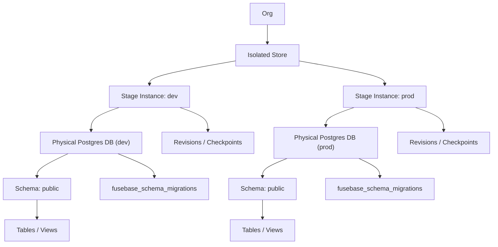
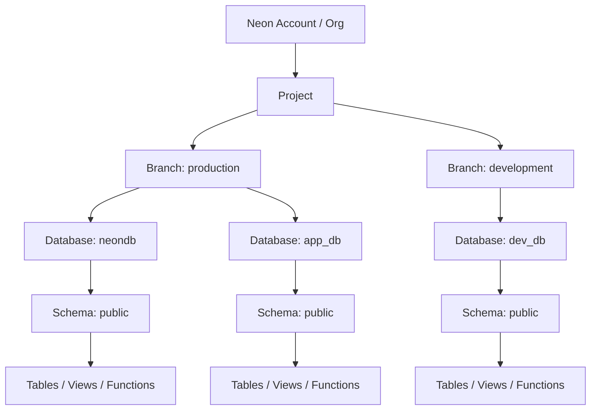
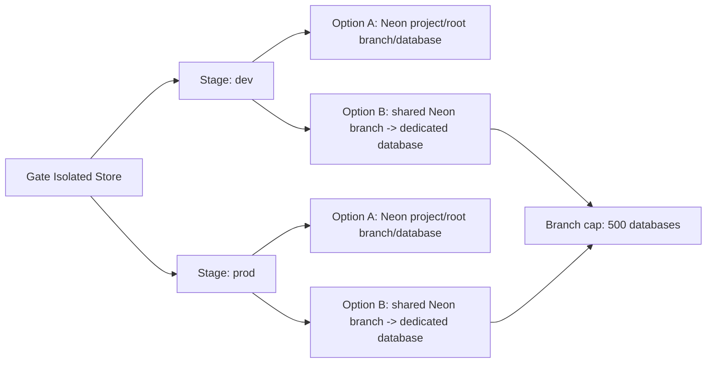

# Isolated stores hierarchy: Gate vs Neon

> **SOURCE**: This file is copied from `docs/isolated-store-hierarchy.md` in the fusebase-gate repo. Edit that file, then run `npm run mcp:skills:generate`.

---
# Isolated stores hierarchy: Gate vs Neon

Reference for how the current Gate isolated-store model is structured, how Neon is structured, and where the important limits sit.

## 1. Gate isolated stores hierarchy

Current Gate model, top-down:

1. `org`
2. `isolated store`
3. `stage instance`
4. `physical database`
5. `schema`
6. `table`

Important side objects:

- `revisions` / `checkpoints` are attached to a **stage instance**
- SQL migration journal `fusebase_schema_migrations` lives **inside the stage database**
- runtime permissions and optional `resource_scope` checks are evaluated against the store and stage-instance identities, not directly against schemas or tables

### Stage model in practice

For the current Gate contract, the important unit is not just the store, but the **stage instance**.

A stage instance owns:

- the logical stage name: `dev` or `prod`
- the current stage status such as `ready` or `provisioning`
- the provider binding config for the physical database
- stage-local provisioning metadata
- stage-local revisions / checkpoints
- for SQL stores, the stage-local migration journal inside that stage database

That means:

- `dev` and `prod` are not two views over one database
- they are two separate stage instances
- each stage instance can sit at a different migration head
- each stage instance has its own restore history and snapshot lineage

In other words:

- `store` = logical app-owned data asset
- `stage instance` = concrete environment of that asset
- `revision` = point-in-time snapshot of one specific stage instance

### What each level means

- **Org**
  Top-level ownership boundary for the store registry.

- **Isolated store**
  Logical app-owned data asset registered in Gate.
  A store is bound to:
  - an org
  - a source scope such as `app`
  - an engine / store type; for the current app-facing skills and MCP guidance, the active baseline is `sql/postgres`

- **Stage instance**
  Environment boundary for the store.
  In the current contract this is intentionally simple and fixed to:
  - `dev`
  - `prod`

  A stage instance is the level where Gate tracks:
  - readiness / provisioning state
  - binding config
  - migration history
  - checkpoint / restore history
  - latest applied migration bundle metadata for Studio

- **Physical database**
  For the current SQL path, each stage instance binds to its own physical database.
  This is the core isolation choice:
  - `dev` database is separate from `prod`
  - migrations and data can diverge legitimately per stage

- **Schema**
  Normal PostgreSQL namespace, usually `public`.

- **Table**
  Normal PostgreSQL tables and views inside the stage database.

### Gate hierarchy diagram

### Gate limits / current constraints

Current hard or explicit constraints in the Gate contract:

- stage names are currently limited to **`dev`** and **`prod`**
- each stage has its **own physical database**
- revisions/checkpoints are scoped to a **stage instance**
- restore always targets a **single stage instance**, never the whole store
- SQL migration status / apply is evaluated **per stage instance**
- `selectIsolatedStoreSqlRows`
  - default limit `100`
  - max `500`
  - max `20` filters
  - max `5` sort fields
- `batchInsertIsolatedStoreSqlRows`
  - max rows per call = `floor(65535 / columnCount)`
- `importIsolatedStoreSqlRows`
  - default max payload `64 MiB`
  - hard cap `256 MiB`

What is **not** currently documented as a hard product limit:

- max isolated stores per org
- max revisions per stage
- extra stage names beyond `dev` / `prod`

Operationally those are still bounded by provider capacity and retention policy, but not by a small explicit Gate quota today.

### Stage lifecycle summary

Current lifecycle for a new SQL store usually looks like:

1. `createIsolatedStore`
2. `initIsolatedStoreStage(dev)`
3. `getIsolatedStoreSqlMigrationStatus(dev)`
4. `applyIsolatedStoreSqlMigrations(dev)`
5. optional `createIsolatedStoreCheckpoint(dev)`
6. later repeat the same flow for `prod`

Important operational rule:

- promotion is not implicit
- applying migrations to `dev` does not move `prod`
- restoring a `dev` revision does not affect `prod`
- every stage is managed independently even though both belong to the same store

## 2. Neon hierarchy

Neon model, top-down:

1. `account / org`
2. `project`
3. `branch`
4. `database`
5. `schema`
6. `table`

### What each level means

- **Project**
  Top-level Neon workspace.
  Contains:
  - branches
  - compute endpoints
  - roles
  - storage and billing context

- **Branch**
  Copy-on-write isolated data environment inside a project.
  Branches inherit schema and data from their parent at creation time.

- **Database**
  Regular PostgreSQL database inside a branch.
  Schemas and tables live here.

- **Schema**
  Normal PostgreSQL namespace.

- **Table**
  Normal PostgreSQL table.

### Neon hierarchy diagram

### Neon limits relevant to this comparison

Important explicit limits and packaging constraints from Neon docs/pricing:

- **500 databases per branch**
- plan-level project counts currently described roughly as:
  - **Free**: up to `100` projects
  - **Launch**: up to `100` projects
  - **Scale**: `1000+` projects

This means the critical density cap for our current mental model is not the project itself, but the fact that databases are packed **inside a branch**.

## 3. Mapping notes

### Closest conceptual mapping

If we compare objects by meaning:

| Gate                    | Neon                                                               |
| ----------------------- | ------------------------------------------------------------------ |
| `isolated store`        | closest to an app-owned logical asset, not a single Neon primitive |
| `stage instance`        | closest to a Neon environment boundary                             |
| stage physical database | closest to a Neon `database`                                       |
| stage lifecycle         | could later map to a Neon `branch`, but does not have to           |

### Two practical Neon mappings for Gate

#### Option A: conservative isolation

- `one Gate stage = one Neon project + root branch + one database`

Pros:

- strongest isolation
- avoids fast collision with the `500 databases per branch` cap
- closest to current Azure mental model

Cons:

- more provider objects
- less dense packing

#### Option B: denser packing

- `one Gate stage = one database inside a shared Neon branch`

Pros:

- denser packing
- simpler provider footprint

Cons:

- hard cap of `500 databases per branch`
- more coupling between stage-databases packed into the same branch context
- less conservative than the current dedicated-database-per-stage mental model

### Mapping diagram

## 4. Practical summary

- In **Gate**, the critical isolation choice today is:
  - **store -> stage -> dedicated database**
- In **Neon**, the critical packaging fact is:
  - **project -> branch -> database**
  - and **500 databases per branch**

So:

- our current Gate stage is closest in shape to a **database**
- but Neon databases do not sit directly under a project; they sit under a **branch**
- that makes Neon viable as a provider, but it introduces a clear branch-level density limit that we must account for if we keep the current `one stage = one database` mental model
---

## Version

- **Version**: 1.0.0
- **Category**: specialized
- **Last synced**: 2026-05-07
